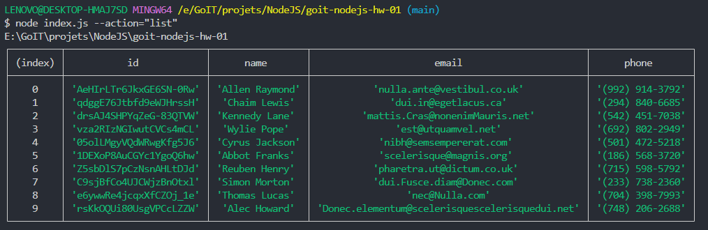
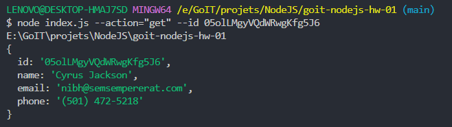
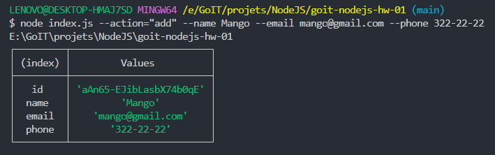
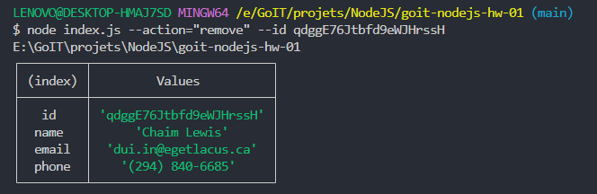

# Отримуємо і виводимо весь список контактів у вигляді таблиці (console.table)

node index.js --action="list"

 
https://ibb.co/JCdmFt4

# Отримуємо контакт по id

node index.js --action="get" --id 05olLMgyVQdWRwgKfg5J6

 
https://ibb.co/S6DsFLw

# Додаємо контакт

node index.js --action="add" --name Mango --email mango@gmail.com --phone 322-22-22

 
https://ibb.co/F8L8V4P

# Видаляємо контакт

node index.js --action="remove" --id qdggE76Jtbfd9eWJHrssH

 
https://ibb.co/7XrzP7z
